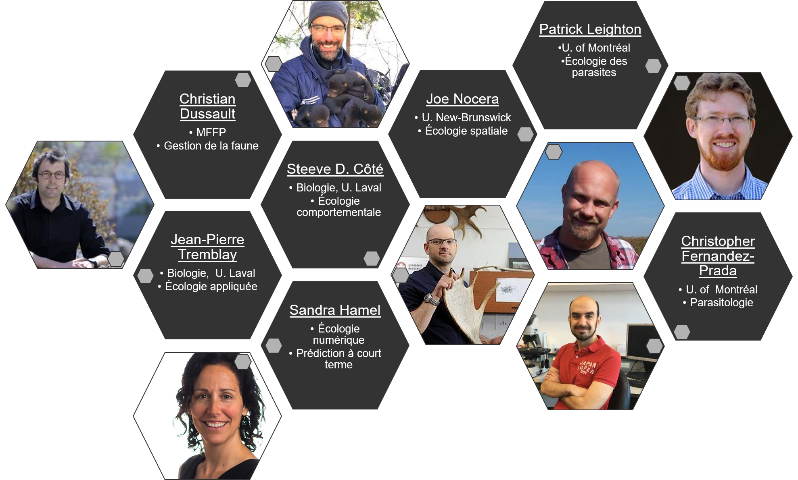
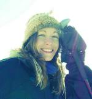
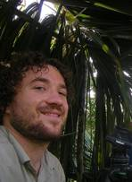
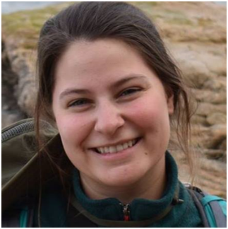
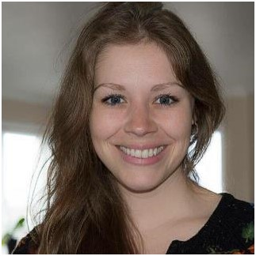

\
\

# Chercheurs

\
\

  

\
\

## Coordonnées:

___

E-Mail  | Institution  | Site Web
------------- | ------------- | -------------
[Jean-Pierre Tremblay](mailto:jean-pierre.tremblay@bio.ulaval.ca)  | Université Laval  | [Lien](https://www.bio.ulaval.ca/departement-et-professeurs/professeurs-et-personnel/professeurs/fiche/show/tremblay-jean-pierre/)
[Steeve D. Côté](mailto:steeve.cote@bio.ulaval.ca) | Université Laval  | [Lien](http://steeve-cote.bio.ulaval.ca/)
[Christian Dussault](mailto: christian.dussault@mffp.gouv.qc.ca)  | MFFP  | [Lien](https://mffp.gouv.qc.ca/la-faune/forum-faune/experts/christian-dussault/)
[Joe Nocera](mailto:jnocera@unb.ca)  | Université du Nouveau-Brunswick  | [Lien](https://noceralabunb.wixsite.com/noceralabunb/research)
[Patrick Leighton](mailto:patrick.a.leighton@umontreal.ca)  | Université de Montréal  | [Lien](https://grezosp.com/)
[Christopher Fernandez-Prada](mailto:christopher.fernandez.prada@umontreal.ca)  | Université de Montréal  | [Lien](https://fmv.umontreal.ca/etudes/personnel-enseignant/fiche/in/in22441/sg/Christopher%20Fernandez%20Prada/)
[Sandra Hamel](mailto:Sandra.Hamel@bio.ulaval.ca)  | Université Laval  | [Lien](https://sites.google.com/site/sandrahamel18/home)  

\
\

___

# Professionnels de recherche

**Catherine Évelyne Bajzak** 

(MSc. [E-mail](mailto:catherine.bajzak@bio.ulaval.ca))

Université Laval, Département de Biologie (QC,Canada)

418-656-2131 poste 7537

catherine.bajzak@bio.ulaval.ca

\
\
\
\

**Julien Hénault Richard**

(MSc. [E-mail](mailto:Julien.H-Richard@bio.ulaval.ca))

Université Laval, Département de biologie (QC, Canada)

418-656-7769

julien.henault-richard.1@ulaval.ca

\
\
\
\
\

___

# Étudiants gradués

## Axe 1. Santé, dynamique et écologie des populations d'orignaux
\

___

**Delphine de Pierre** 

(2017- présent; [E-mail](mailto:delphine.de-pierre.1@ulaval.ca))

Objectifs : Évaluer la relation entre la charge parasitaire à la fin de l'automne / début de l'hiver et la condition corporelle des orignaux au printemps et vérifier l'efficacité le la Permethrine comme acaricide pour manipuler la charge de tiques.

\
\
\
\
\

___

**Catherine Pouchet**  

(2019 - présent; [E-mail](mailto:catherine.pouchet.1@ulaval.ca))

Objectifs: Déterminer s’il existe une interaction entre la tique d’hiver et les endoparasites, à savoir si leurs effets sur la condition corporelle des orignaux puissent être additifs, et ce, selon différents facteurs environnementaux.

\
\
\
\
\

## Axe 2. Biologie et épidémiologie de la tique d'hiver

___

## Axe 3. Gestion participative

___

